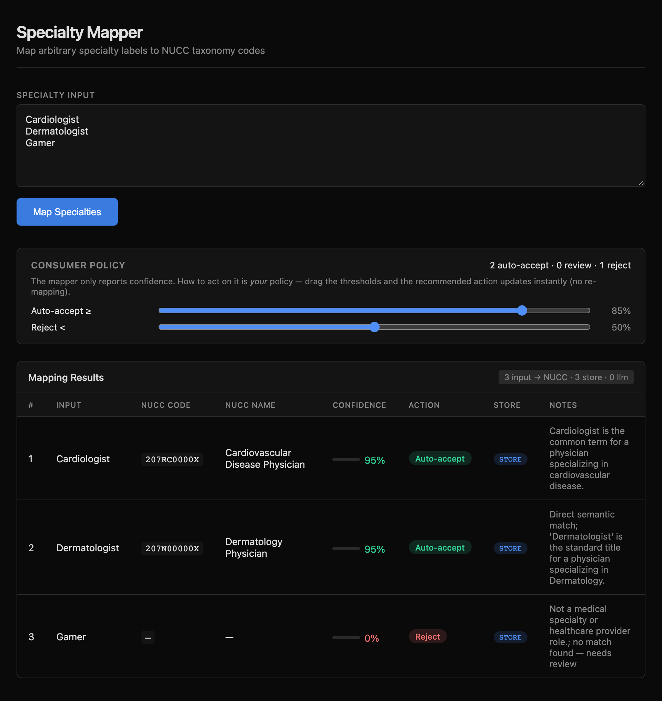

# Specialty Mapper

**Free-text specialty label → NUCC taxonomy code**, in two stages: an LLM picks the
name, a deterministic lookup supplies the code. One FastAPI server, one web UI,
no build step, no external services beyond your LLM endpoint.

[](https://www.python.org/)
[](https://fastapi.tiangolo.com/)
[](https://www.nucc.org/)
[](https://qwenlm.github.io/)
[](http://localhost:8645)

<p align="center">
  
  <br><em>The web UI: paste labels, drag the consumer-policy sliders, watch the
  recommended action recompute live.</em>
</p>

This repo contains the **mapping tool** and the master NUCC reference it runs
against. The tool is **NUCC-only**: it maps free-text labels to NUCC display names
and codes. The eval is seeded from the NUCC taxonomy itself (no state data). A
companion repo, `medicaid-state-specialty-ref`, holds verified per-state Medicaid
specialty data for a **parked** state-mapping extension — the tool and its eval do
not read it.

## How It Works

Two stages, and the split is the whole point: the LLM only ever proposes a *name*,
a deterministic lookup supplies the *code*.

```
"Cardiologist"
   │  1  LLM picks a NUCC display name  (the 883 names are in the prompt, codes are not)
   ▼
"Cardiovascular Disease Physician"   @ 0.95
   │  2  deterministic lookup in the 883-row NUCC CSV
   ▼
207RC0000X        (never LLM-generated)
```

Non-medical input takes a different path and is never forced into a match:

```
"Gamer"  →  no medical connotation  →  nucc_code: null, confidence 0.0   (cached, flagged for review)
```

- The LLM sees only the 883 NUCC **display names** (codes are withheld), so it can
  only ever propose a name — the code always comes from the dataset.
- Every result is persisted to a local SQLite store; recurring inputs return in ~1ms
  instead of ~1–2s, and the store is a compounding, auditable data asset.
- The store is a local file (`demo/mapping_cache.sqlite3`): rows are tagged with the
  taxonomy version they were produced under, so a NUCC version bump invalidates
  prior-version entries cleanly; only *misses* ever reach the LLM.
- `nucc_code: null` is a first-class answer for non-medical input, and it is cached
  too. The API reports confidence only; accept/review/reject policy lives in the
  consumer (the UI's sliders are that boundary, made visible).

## Architecture

End-to-end: browser → server pipeline (split → cache pass → LLM → parse → code
lookup) → policy-agnostic JSON response. The LLM only ever sees cache misses, and
the code never leaves the dataset.

<p align="center">
  <a href="docs/specialty-mapper-architecture.svg"></a>
</p>

## Try It

Start the server, then map a few labels:

```bash
python3 -m uvicorn demo.main:app --host 0.0.0.0 --port 8645
```

```bash
curl -s -X POST http://localhost:8645/api/map \
  -H 'Content-Type: application/json' \
  -d '{"text": "Cardiologist\nDermatologist\nGamer"}'
```

```json
{
  "results": [
    { "input": "Cardiologist",  "nucc_code": "207RC0000X", "nucc_name": "Cardiovascular Disease Physician",
      "confidence": 0.95, "notes": "Cardiologist is the common term for a physician specializing in cardiovascular disease.",
      "source": "cache" },
    { "input": "Dermatologist", "nucc_code": "207N00000X", "nucc_name": "Dermatology Physician",
      "confidence": 0.95, "notes": "Direct semantic match; 'Dermatologist' is the standard title for a physician specializing in Dermatology.",
      "source": "cache" },
    { "input": "Gamer",         "nucc_code": null, "nucc_name": null,
      "confidence": 0.0, "notes": "Not a medical specialty or healthcare provider role.",
      "source": "cache" }
  ],
  "input_count": 3, "cache_hits": 3, "cache_misses": 0
}
```

Then open `http://localhost:8645` for the web UI. (Equivalent script:
`python3 scripts/run_server.py`.) The backend expects an LLM endpoint at
`http://localhost:8080/v1` (Qwen 27B via the LaunchAgent TCP relay, which
auto-discovers the Windows llama-server — its DHCP IP changes) and nothing else.
Adjust `LLM_BASE_URL` / `LLM_MODEL` in `demo/main.py` to reconfigure.

## Repo Layout

```
specialty-mapper/
├── README.md
├── PROMOTION_PLAN.md          # GTM / business model
├── PITCH.md                   # The "we already have a Claude license" objection
├── EVAL_HARNESS_SPEC.md       # Evaluation harness design (spec, not yet built)
├── pyproject.toml             # Project + pytest config (test suite wired up)
├── conftest.py                # Pytest path bootstrap (demo/ on sys.path)
├── tests/                     # Test suite: NUCC bijection + mapping store
│   ├── test_nucc_bijection.py
│   └── test_cache.py
├── data/
│   └── nucc/
│       └── nucc_taxonomy_251.csv   # Master NUCC reference (v25.1, 883 codes)
├── demo/
│   ├── main.py                # FastAPI backend (LLM call + cache)
│   ├── cache.py               # SQLite mapping store (lookup/store/override)
│   ├── requirements.txt
│   └── static/index.html      # Web UI
├── docs/
│   ├── mapper-product.md      # Mapper product spec
│   ├── fde-engagement-plan.md # FDE arc → skill → artifact map
│   ├── startup-advice-validated.md
│   ├── specialty-mapper-architecture.svg
│   └── screenshot.png
├── scripts/
│   ├── run_server.py          # uvicorn runner
│   ├── start_demo.sh
│   └── start_bg.sh
└── reports/                   # Demo output artifacts
```

## Tests

```bash
python3 -m pytest            # run the suite (NUCC bijection + mapping store)
```

The suite is dependency-light (pytest only) and non-destructive: it runs against the
read-only NUCC CSV and touches only throwaway cache keys.

## API

| Method | Path | Description |
|--------|------|-------------|
| `GET`  | `/`            | Web UI |
| `POST` | `/api/map`     | Map specialties (body: `{"text": "...\n..."}`) |
| `GET`  | `/api/cache/stats` | Cache stats for the current taxonomy version |
| `GET`  | `/api/cache`   | List cached mappings (`?limit=` / `?offset=`) |
| `DELETE` | `/api/cache/{input_key}` | Override: remove an entry to force re-map |

Response:
```json
{
  "results": [
    {
      "input": "Cardiologist",
      "nucc_code": "207RC0000X",
      "nucc_name": "Cardiovascular Disease Physician",
      "confidence": 0.98,
      "notes": "Direct match."
    }
  ],
  "input_count": 1
}
```

**Consumer policy:** the API is policy-agnostic — it reports confidence, never an
action. The web UI adds a Consumer Policy panel with two thresholds (auto-accept ≥ 85%,
reject < 50% by default) that drive a per-row **Recommended Action** column, recomputed
live as you drag the sliders. Rows with no resolved code are always Reject. In
production the thresholds live in the consumer pipeline, not in this mapper.

## Companion Data Repo

`medicaid-state-specialty-ref` holds the verified per-state Medicaid specialty
datasets (11 states) and NUCC→state crosswalks. It is a **parked extension** for
future state-specific mapping — **not** the substrate for this mapper's eval (which
is NUCC-native). See that repo's `README.md` and `AGENTS.md` for its data contract
and verification standard.

## References

- [NUCC Provider Taxonomy Code Set](https://www.nucc.org/)
- [NPPES Taxonomy Search](https://npiregistry.cms.hhs.gov/)
